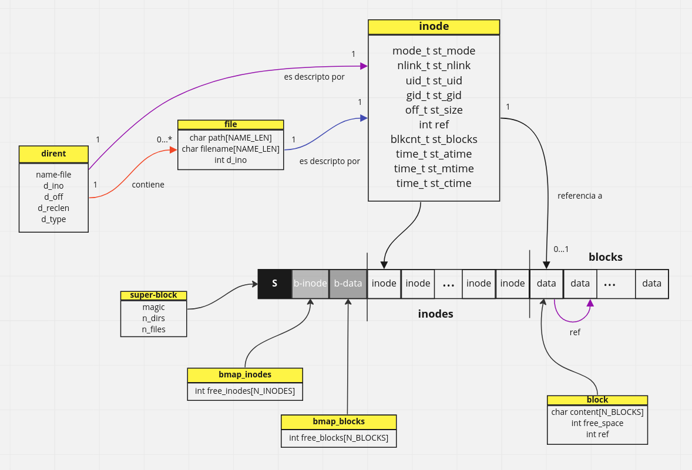

# FISOPFS: FUSE 유형 파일 시스템

이 프로젝트는 FIUBA 운영 체제 과목의 [실습 과제 No.3](https://fisop.github.io/website/tps/filesystem/)를 기반으로 구현한 것입니다.

Filesystem in Userspace(FUSE)는 커널 코드를 수정하지 않고 비특권 사용자가 직접 파일 시스템을 만들 수 있게 해주는 UNIX 계열 운영 체제용 소프트웨어 인터페이스입니다. 파일 시스템 코드를 사용자 영역에서 실행하고, FUSE 모듈이 커널의 실제 인터페이스와 사용자 공간 코드를 연결하는 역할을 합니다.

## 의존성

```
sudo apt update && sudo apt install pkg-config libfuse2 libfuse-dev
```

## 구조

FISOPFS는 Remzi Arpaci-Dusseau의 저서 \_Operating Systems: Three Easy Pieces\_에 수록된 [vsfs](https://pages.cs.wisc.edu/~remzi/OSTEP/file-implementation.pdf) (Very Simple File System) 개념을 기반으로 합니다.

 

 

### 블록

이 프로그램은 256바이트 용량의 블록 256개를 관리하며, 총 65,536바이트의 파일 데이터 저장 용량을 제공합니다. 각 블록에는 남은 여유 공간 크기 정보와, 동일 파일의 다음 데이터 블록을 가리키는 참조(선택적)가 저장됩니다.

### 아이노드(Inodo)

아이노드는 파일 시스템의 핵심 요소로, 파일이나 디렉터리에 대한 메타데이터를 1:1로 저장합니다. 파일을 나타내는 아이노드는 해당 파일의 첫 번째 데이터 블록을 가리키는 참조를 포함합니다.

아이노드 개수는 상수로 정의되어 쉽게 확장할 수 있지만, 현재 파일 시스템은 총 64개의 아이노드를 지원합니다(아이노드:블록 비율 1:4). 이로 인해 평균 파일 크기는 1,024바이트이며, 아이노드당 최대 블록 수는 16개로 설정되어 파일당 최대 크기는 4,096바이트입니다.

### 비트맵(Bitmap)

새 블록이나 아이노드를 할당할 때는 freelist 역할을 하는 비트맵 구조체를 사용합니다. 비트맵은 정수 벡터 형태로, 실제 아이노드/블록 테이블의 각 인덱스 상태(0 = 비어 있음, 1 = 사용 중)를 기록합니다.

### 슈퍼블록(Superbloque)

슈퍼블록은 파일 시스템의 파일 수, 디렉터리 수, 할당된 블록 수 등의 정보를 저장합니다. 또한 초기화 검증을 위한 매직 넘버를 상수로 보관합니다. 슈퍼블록은 메모리에 가장 먼저 로드되는 데이터 구조이므로, 매직 넘버가 올바르지 않으면 파일 시스템 초기화에 실패했다고 판단합니다.

파일 시스템에서 사용하는 모든 정보는 메모리에 저장되며, 다음 전역 변수들에서 확인할 수 있습니다:

```c
struct superblock *sb;
struct bmap_inodes *bitmap_inodes;
struct bmap_blocks *bitmap_blocks;
struct inode *inodes;
struct block *blocks;
struct file *files;
struct dirent *dirs;
```

## FISOPFS에서 지원하는 작업

#### 파일 생성 (touch, 쓰기 리디렉션)

```
manu@manu:~/Desktop/sisop_2022b_g23/fisopfs/mount$ touch asd.txt
manu@manu:~/Desktop/sisop_2022b_g23/fisopfs/mount$ echo "hola" > abc.txt
manu@manu:~/Desktop/sisop_2022b_g23/fisopfs/mount$ ls
abc.txt  asd.txt
```

#### 디렉터리 생성 (mkdir)

```
manu@manu:~/Desktop/sisop_2022b_g23/fisopfs/mount$ mkdir dir
manu@manu:~/Desktop/sisop_2022b_g23/fisopfs/mount$ ls
abc.txt  asd.txt  dir
```

#### 파일 읽기 (cat, more, less 등)

```
manu@manu:~/Desktop/sisop_2022b_g23/fisopfs/mount$ cat abc.txt
hola
```

#### 파일 쓰기 (덮어쓰기 및 append)

```
manu@manu:~/Desktop/sisop_2022b_g23/fisopfs/mount$ echo "mundo" >> abc.txt
manu@manu:~/Desktop/sisop_2022b_g23/fisopfs/mount$ cat abc.txt
hola
mundo
manu@manu:~/Desktop/sisop_2022b_g23/fisopfs/mount$ echo "chau" > abc.txt
manu@manu:~/Desktop/sisop_2022b_g23/fisopfs/mount$ cat abc.txt
chau
```

#### 파일 삭제 (rm 또는 unlink)

```
manu@manu:~/Desktop/sisop_2022b_g23/fisopfs/mount$ ls
abc.txt  asd.txt  dir
manu@manu:~/Desktop/sisop_2022b_g23/fisopfs/mount$ rm abc.txt
manu@manu:~/Desktop/sisop_2022b_g23/fisopfs/mount$ ls
asd.txt  dir
```

#### 디렉터리 삭제 (rmdir)

```
manu@manu:~/Desktop/sisop_2022b_g23/fisopfs/mount$ rmdir dir
manu@manu:~/Desktop/sisop_2022b_g23/fisopfs/mount$ ls
asd.txt
```

---

## 도전 과제

### 다중 중첩 디렉터리

다음 사항을 지원해야 합니다:

* 두 개 이상의 디렉터리 레벨
* 디렉터리 깊이와 경로 길이에 대한 최대 한계 설정

이를 위해 각 디렉터리에 부모 디렉터리를 가리키는 **parent** 속성을 추가했습니다. 루트 디렉터리는 부모가 없으므로 해당 값이 -1입니다.

경로 이름 길이 한계는 `FS_FILENAME_LEN = 64`로, 디렉터리 깊이 한계는 `MAX_DEPTH_DIR = 8`로 정의되어 있습니다. 이 한계를 초과하여 디렉터리나 파일을 생성하면 오류를 발생시킵니다.

```
manu@manu:~/Desktop/sisop_2022b_g23/fisopfs/mount$ cd a
manu@manu:~/Desktop/sisop_2022b_g23/fisopfs/mount/a$ mkdir b
manu@manu:~/Desktop/sisop_2022b_g23/fisopfs/mount/a$ cd b
manu@manu:~/Desktop/sisop_2022b_g23/fisopfs/mount/a/b$ mkdir c
manu@manu:~/Desktop/sisop_2022b_g23/fisopfs/mount/a/b$ cd c
manu@manu:~/Desktop/sisop_2022b_g23/fisopfs/mount/a/b/c$ mkdir d
manu@manu:~/Desktop/sisop_2022b_g23/fisopfs/mount/a/b/c$ cd d
manu@manu:~/Desktop/sisop_2022b_g23/fisopfs/mount/a/b/c/d$ mkdir e
manu@manu:~/Desktop/sisop_2022b_g23/fisopfs/mount/a/b/c/d$ cd e
manu@manu:~/Desktop/sisop_2022b_g23/fisopfs/mount/a/b/c/d/e$ mkdir f
manu@manu:~/Desktop/sisop_2022b_g23/fisopfs/mount/a/b/c/d/e$ cd f
manu@manu:~/Desktop/sisop_2022b_g23/fisopfs/mount/a/b/c/d/e/f$ mkdir g
manu@manu:~/Desktop/sisop_2022b_g23/fisopfs/mount/a/b/c/d/e/f$ cd g
manu@manu:~/Desktop/sisop_2022b_g23/fisopfs/mount/a/b/c/d/e/f/g$ mkdir h
mkdir: cannot create directory ‘h’: Numerical result out of range

manu@manu:~/Desktop/sisop_2022b_g23/fisopfs/mount/a/b/c/d/e/f/g$ echo "hola mundo" > hola.txt
manu@manu:~/Desktop/sisop_2022b_g23/fisopfs/mount/a/b/c/d/e/f/g$ cat hola.txt
hola mundo

manu@manu:~/Desktop/sisop_2022b_g23/fisopfs/mount/a/b/c/d/e/f/g$ touch aaaaaaaaaaaaaaaaaaaaaaaaaaaaaaaaaaaaaaaaaaaaaaaaaaaaaaaaaaaaaaaaaaaaaaaaaaaaaaaaaaaaaaaaaaaaaaaaaaaaaaaaaaaaaaaaaaaaaaaaaaaaaaaaaaaaaaaaaaaa
touch: cannot touch 'aaaaaaaaaaaaaaaaaaaaaaaaaaaaaaaaaaaaaaaaaaaaaaaaaaaaaaaaaaaaaaaaaaaaaaaaaaaaaaaaaaaaaaaaaaaaaaaaaaaaaaaaaaaaaaaaaaaaaaaaaaaaaaaaaaaaaaaaaaaa': Numerical result out of range
```

### 권한 및 소유권

파일이나 디렉터리의 권한 및 소유권 변경을 지원합니다. 예를 들어, `manu` 사용자가 파일을 생성하면 `manu`가 소유자(uid)이므로 읽기/쓰기 권한(4+2)이 부여됩니다.

```
manu@manu:~/Desktop/sisop_2022b_g23/fisopfs/mount$ echo "hola mundo" > archivo
manu@manu:~/Desktop/sisop_2022b_g23/fisopfs/mount$ stat archivo
  File: archivo
  Size: 11        	Blocks: 1    IO Block: 4096   regular file
Device: 34h/52d	Inode: 4     Links: 1
Access: (0664/-rw-rw-r--)  Uid: (1000/manu)   Gid: (1000/manu)
Access: 2022-12-20 18:55:58.000000000 -0300
Modify: 2022-12-20 18:55:55.000000000 -0300
Change: 2022-12-20 18:55:55.000000000 -0300
 Birth: -
manu@manu:~/Desktop/sisop_2022b_g23/fisopfs/mount$ cat archivo
hola mundo
```

`test` 사용자와 `grupo` 그룹으로 소유권을 변경(chown)하면 `manu`는 `other` 권한(읽기만 가능)만 갖습니다.

```
manu@manu:~/Desktop/sisop_2022b_g23/fisopfs/mount$ chown test:grupo archivo
manu@manu:~/Desktop/sisop_2022b_g23/fisopfs/mount$ stat archivo
  File: archivo
  Size: 11        	Blocks: 1    IO Block: 4096   regular file
Device: 34h/52d	Inode: 4     Links: 1
Access: (0664/-rw-rw-r--)  Uid: (1001/test)   Gid: (1002/grupo)
Access: 2022-12-20 18:56:27.000000000 -0300
Modify: 2022-12-20 18:55:55.000000000 -0300
Change: 2022-12-20 18:56:25.000000000 -0300
 Birth: -
manu@manu:~/Desktop/sisop_2022b_g23/fisopfs/mount$ echo "chau" >> archivo
bash: echo: write error: Permission denied
```

디렉터리는 생성 시 읽기/쓰기/실행 권한이 부여됩니다. 실행 권한은 디렉터리 접근과는 무관하며, 쓰기 권한이 있으면 디렉터리 내 생성/삭제가 가능합니다.

```
manu@manu:~/Desktop/sisop_2022b_g23/fisopfs/mount$ ls
archivo  dir
manu@manu:~/Desktop/sisop_2022b_g23/fisopfs/mount$ stat dir
  File: dir
  Size: 0         	Blocks: 0    IO Block: 4096   directory
Device: 34h/52d	Inode: 3     Links: 3
Access: (0751/drwxr-x--x)  Uid: (1000/manu)   Gid: (1000/manu)
Access: 2022-12-20 18:59:31.000000000 -0300
Modify: 2022-12-20 08:20:01.000000000 -0300
Change: 2022-12-20 18:59:11.000000000 -0300
 Birth: -
manu@manu:~/Desktop/sisop_2022b_g23/fisopfs/mount/dir$ touch otro.archivo
manu@manu:~/Desktop/sisop_2022b_g23/fisopfs/mount/dir$ ls
abc.txt  otro.archivo
```

디렉터리의 권한을 읽기/실행만 허용(551)으로 변경하면, 파일 생성/삭제가 불가능합니다.

```
manu@manu:~/Desktop/sisop_2022b_g23/fisopfs/mount$ chmod 551 dir
manu@manu:~/Desktop/sisop_2022b_g23/fisopfs/mount$ cd dir
manu@manu:~/Desktop/sisop_2022b_g23/fisopfs/mount/dir$ rm otro.archivo
rm: cannot remove 'otro.archivo': Permission denied
manu@manu:~/Desktop/sisop_2022b_g23/fisopfs/mount/dir$ ls
abc.txt  otro.archivo
```

읽기 권한이 없으면 디렉터리 내용을 조회할 수 없습니다:

```
manu@manu:~/Desktop/sisop_2022b_g23/fisopfs/mount$ chmod 151 dir
manu@manu:~/Desktop/sisop_2022b_g23/fisopfs/mount$ cd dir
manu@manu:~/Desktop/sisop_2022b_g23/fisopfs/mount/dir$ ls
ls: reading directory '.': Permission denied
```
